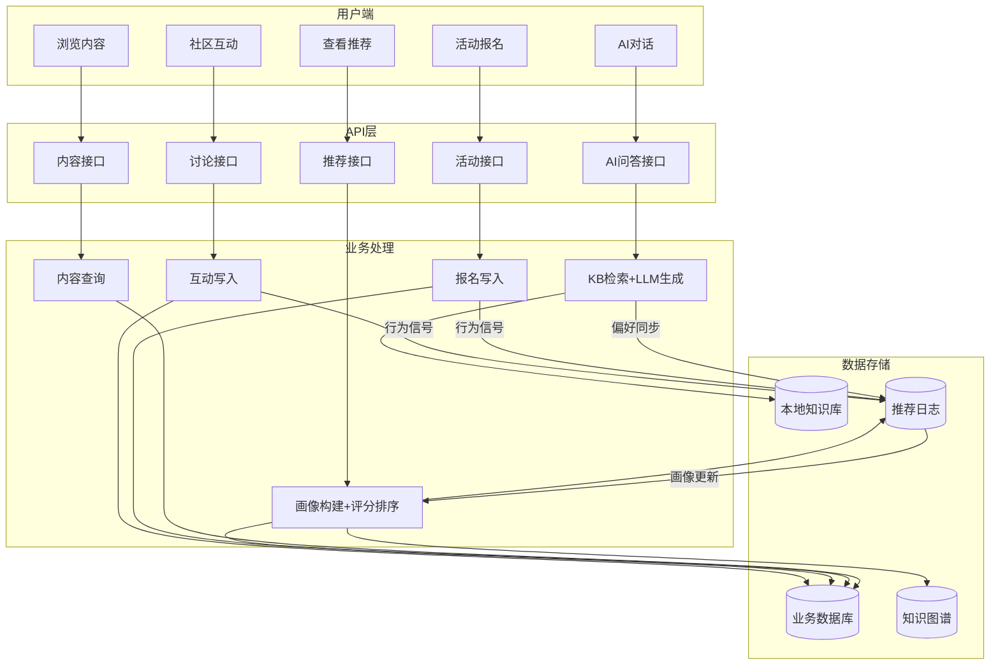

3 系统分析

3.1 需求背景分析

根据第一章的论述，非遗数字化正在发生由以保存为目的的数字化记录向以传播为目的的数字化创作的转变，呈现出视频化和体验感、要素开源化和数字化潜能、数字化生存和虚拟社区传承三个趋势[1]。但是目前大多数非遗数字平台还处在"单向展示"的阶段，缺少个性化服务的能力和智能交互的手段，是不能满足上述转型的需求的。

通过对目前的非遗文化传播平台及有关系统进行调研分析，可以发现这些平台还存在着如下不足之处。以推荐能力弱为首要短板，现有的非遗小程序大多采用热门排序或者简单的分类浏览来展示内容，没有根据用户的喜好来提供个性化的推荐；以交互方式单一为第二短板，现有的平台以图文展示为主，缺少语音、对话等多模态交互的方式，用户只能被动地浏览内容，不能用自然语言提问或者和系统进行深入的交互；以场景感知缺失为第三短板，用户对非遗内容的兴趣受到时间、地点、文化情境等各方面因素影响较大，端午节前后用户对龙舟、粽子相关的非遗的关注度明显提高，现有的系统却不能够捕捉到这些情境信息；以冷启动问题严重为第四短板，非遗领域的受众面窄，用户行为数据本身就很稀疏[8]，新用户注册之后没有历史行为数据，系统不能给出有效的个性化推荐，用户流失的情况比较严重；以推荐结果不可解释为第五短板，大多数推荐系统只给出推荐结果，不给出推荐理由，用户很难理解系统为什么推荐某项非遗内容，影响到用户的信任度和使用意愿[7]。

赵梦媛等在对话推荐算法研究综述中认为传统的推荐系统存在三个基本的缺陷，即使用稀疏且带有噪声的历史数据来估计用户的偏好是不可靠的，忽略了影响用户行为的在线上下文环境因素是上下文敏感性的表现，默认用户知道自己的喜好是不可靠的假设[6]。对话推荐系统（Conversational Recommendation System，CRS）依靠多轮互动及时获得用户的反应，不断调整偏好，冲破信息不对称，给以上问题的解决赋予了理论架构。将CRS的思想运用到非遗文化传播的场景当中，用AI数字人来实现"系统提问-用户回答"的SAUR交互模式，在对话的过程中主动去发现用户的喜好，解决冷启动的问题，利用知识图谱来提高推荐的多样性和可解释性，以CRS为引导、以知识图谱为增强、以AI数字人为载体，构建起非遗文化传播的智能化服务框架。

3.2 可行性分析

3.2.1 技术可行性

（1）前端技术可行。微信小程序是成熟的一种移动应用开发框架，有完整的组件体系、API接口和开发工具链。本系统使用微信小程序原生开发，不需要第三方UI库的支持，可以完全控制界面的表现和交互体验。小程序的微信登录、分享、定位这些原生功能可以直接使用，降低了开发的成本。

（2）后端技术可行。FastAPI是Python生态中高性能的异步Web框架，自带OpenAPI文档生成、请求参数校验等功能，适合快速构建RESTful API。SQLAlchemy是ORM框架，可以实现和SQLite、MySQL等不同数据库之间的无缝切换，满足从SQLite到MySQL的迁移。以上技术栈在工业界得到了广泛的应用，技术成熟度高，行之有效。

（3）人工智能技术可行。本系统使用的是"本地知识库-联网搜索-大语言模型"三级回退方式。本地知识库是已经采集、审核过的非遗内容所构成的，用关键词匹配、语义检索来快速响应，联网搜索是补充信息源，大语言模型（豆包大模型API）用来处理复杂的问答和生成推荐理由。该方法借鉴的是辽小博AI智慧导览系统中知识图谱约束大模型输出的技术路线，保证知识的准确性的同时发挥大模型的语义理解和生成能力[2]，取长补短、相得益彰。

（4）推荐算法可行。本系统采用内容特征匹配、行为信号、知识图谱增强这三种方式组合起来的规则加权式推荐方式，而非从零开始训练一个深度推荐模型。李小波等人的研究表明，非遗推荐的中文文本语义信息对于推荐效果的影响最大，本文系统采用非遗特有的标签体系和知识图谱的关联推理技术来进行语义增强，更符合非遗领域数据稀疏的特点[8]，因地制宜、量体裁衣。

3.2.2 经济可行性

本系统的开发成本主要有人力成本、服务器成本和API调用成本三个部分。人力方面，系统由一名开发者独立完成，属于毕业设计项目，不产生额外的人力开支。服务器方面，开发阶段使用SQLite本地数据库，部署阶段可以选用云服务器，月费用在百元以内，经济负担较小。API调用方面，豆包大模型提供免费额度，在开发和演示阶段完全够用，联网搜索接口同样有免费配额。微信小程序的注册、审核、发布均不收取费用。综合来看，本系统的开发和运行的成本处于可控范围之内，不需要大量的资金投入，经济上是可行的，可谓轻装上阵、事半功倍。

3.2.3 操作可行性

（1）用户操作可行。微信小程序不需要安装，用户通过扫码或者搜索就可以使用，操作门槛很低。AI数字人用自然语言对话交流，用户不需要去学习复杂的操作就能得到推荐、问答等服务，开箱即用。

（2）管理操作可行。管理端使用Web界面，内容审核、活动管理、数据统计等操作都配有直接可操作的表单和图表，管理员无需技术知识也能进行日常运营，简单易行。

3.2.4 社会与法律可行性

AI数字人只能用本地的知识库来降低幻觉的出现。用户数据只收集必要的信息，符合《个人信息保护法》的规定。系统传播非遗文化有积极的社会意义，符合《中华人民共和国非物质文化遗产法》第三条关于国家对非物质文化遗产采取认定、记录、建档等措施予以保存，对体现中华民族优秀传统文化且具有历史、文学、艺术、科学价值的非物质文化遗产采取传承、传播等措施予以保护的规定，名正言顺、有法可依。

3.3 功能需求分析

本系统主要为三类人服务。第一类是普通用户，即对非遗文化感兴趣的人群，有学生、文化爱好者、旅游者等，该类用户的最大需求就是方便地获取非遗内容，得到个性化的推荐，和AI数字人进行对话交流，参加活动和社区讨论。第二类是内容管理员，主要对平台的内容进行治理和运营维护，主要需求是内容审核、质量评定、数据收集和基本用户的管理。第三类是系统管理员，主要负责系统的运维和配置工作，对系统参数的设置、运行情况的监控和权限的控制等工作进行技术上的管理和监督。三类角色一起组成了平台内容生产、内容分发和系统维护的基本运转闭环，各司其职、缺一不可。

根据前面所提到的角色和业务场景，系统功能可以分为六个模块。以非遗内容展示与浏览为基础，系统应该具有浏览内容列表、查看内容详情、浏览分类导航、关键词搜索等基本功能，满足用户对于非遗信息"可以被发现、可以被阅读、可以被传播"的基本要求；以个性化推荐为核心，系统首页要对用户画像进行推荐，冷启动阶段可以给出偏好引导，推荐策略要能依照用户的操作的反馈来动态调整，结果层也要给出一些解释性的信息，加强推荐的透明度和可理解性，知识图谱增强能力属于候选补充和解释增强的辅助机制，并不是独立的图计算平台；以AI数字人对话为特色，系统应该支持非遗知识问答、多轮会话管理、对话式推荐触发，使用标准化的ASK提问模板来获取用户的偏好信息，达到"询问-推荐"的互动效果，页面内设置方便快捷的对话入口，使用户的交互更加连贯；以活动报名与管理为延伸，系统应该包含活动列表浏览、活动详情查看、在线报名、报名记录管理等功能，在条件允许的时候还可以提供和用户兴趣相关联的活动推荐功能，加强线上内容和线下体验的联系；以社区互动为补充，系统需要支持帖子浏览、发帖、评论、点赞等基本的社区行为，同时需要有话题标签等组织方式来方便用户围绕非遗主题展开交流和内容沉淀；以用户中心为入口，系统需要支持微信登录、个人偏好设置、收藏管理、个人行为信息展示等功能，给推荐画像的更新和用户的自主管理提供入口。

管理端需求主要是围绕平台治理和运营效率展开的。主要功能有内容审核发布、活动创建与上架下架、用户状态管理、基础统计分析。统计维度可以是访问量、用户的活跃度、推荐的反馈等等各方面内容，供运营决策使用。现阶段知识图谱相关管理能力处于低优先级规划阶段，主要保证推荐主链路的稳定运行之后再逐步增加配置和维护能力。

3.4 系统数据流程图

系统的核心数据流程围绕"用户交互→画像构建→推荐计算→结果展示→行为反馈"这一闭环展开，如下图所示。

用户通过微信小程序发起浏览、提问、报名、互动等操作，前端将请求发送至后端API层。后端根据请求类型分别进入不同的业务处理路径：内容浏览请求直接查询业务数据库返回结果；AI对话请求先检索本地知识库，再调用大语言模型生成回答，同时将问题关键词同步至用户画像模块；推荐请求触发画像构建和评分排序流程，输出推荐列表和推荐理由；活动报名和社区互动请求在完成业务写入的同时，将行为信号回传至推荐日志表。推荐日志和AI问答记录作为画像更新的数据源，在下次推荐计算的时候被重新读取，形成"推荐-反馈-画像更新-再推荐"的闭环，周而复始、循环往复。

![图3-1 系统数据流程图]

（图3-1的Mermaid代码如下，可用draw.io导入）

3.5 系统数据字典

储存在数据库中的是数据表，数据间的关联性由这些数据表构成。系统数据库共包含16张数据表，按照业务领域可以划分为用户域、内容域、活动域、社区域、推荐域和知识域六个部分。部分系统所涉及的数据表如下所示。

（1）用户表（users）

储存系统用户的基本信息、角色标识和CRS推荐画像数据，表结构如下表1所示：

表1 用户表

| 字段名称 | 类型 | 长度 | 字段说明 | 主键 | 默认值 |
|---------|------|------|---------|------|-------|
| id | bigint | | 主键 | 主键 | |
| openid | varchar | 64 | 微信唯一标识 | | |
| nickname | varchar | 64 | 用户昵称 | | |
| phone | varchar | 20 | 手机号 | | |
| role | varchar | 20 | 角色 | | user |
| is_active | boolean | | 是否活跃 | | 1 |
| preferred_heritage_types | text | | 非遗类型偏好(JSON数组) | | |
| preferred_scene_types | text | | 场景偏好(JSON数组) | | |
| preferred_regions | text | | 地区偏好(JSON数组) | | |
| confidence_score | real | | CRS综合置信度(0-100) | | 0 |
| score_explicit | real | | 显式偏好维度分(0-100) | | 0 |
| score_implicit | real | | 隐式行为维度分(0-100) | | 0 |
| score_dialogue | real | | 对话语义维度分(0-100) | | 0 |
| created_at | timestamp | | 创建时间 | | CURRENT_TIMESTAMP |

（2）内容表（contents）

储存非遗内容的核心信息，涵盖标题、正文、来源、审核状态和推荐评分，表结构如下表2所示：

表2 内容表

| 字段名称 | 类型 | 长度 | 字段说明 | 主键 | 默认值 |
|---------|------|------|---------|------|-------|
| id | bigint | | 主键 | 主键 | |
| title | varchar | 200 | 标题 | | |
| cover_url | varchar | 255 | 封面图地址 | | |
| content_type | varchar | 30 | 内容类型 | | |
| source_site | varchar | 120 | 来源站点 | | |
| source_url | varchar | 500 | 来源链接 | | |
| summary | text | | 摘要 | | |
| body | text | | 正文 | | |
| chapter | varchar | 120 | 所属章节 | | |
| sub_chapter | varchar | 120 | 子章节 | | |
| content_hash | varchar | 40 | 正文哈希(去重) | | |
| quality_score | float | | 质量评分 | | 0 |
| review_status | varchar | 20 | 审核状态 | | pending |
| import_batch | varchar | 60 | 导入批次 | | |
| is_featured | boolean | | 是否精选 | | 0 |
| status | varchar | 20 | 发布状态 | | draft |
| published_at | timestamp | | 发布时间 | | |
| created_by | bigint | | 创建人编号 | | |
| created_at | timestamp | | 创建时间 | | CURRENT_TIMESTAMP |

（3）内容收藏表（content_favorites）

储存用户对非遗内容的收藏记录，表结构如下表3所示：

表3 内容收藏表

| 字段名称 | 类型 | 长度 | 字段说明 | 主键 | 默认值 |
|---------|------|------|---------|------|-------|
| id | bigint | | 主键 | 主键 | |
| user_id | bigint | | 用户编号 | | |
| content_id | bigint | | 内容编号 | | |
| created_at | timestamp | | 收藏时间 | | CURRENT_TIMESTAMP |

（4）活动表（activities）

储存非遗活动的基本信息，包括时间、地点、人数限制和发布状态，表结构如下表4所示：

表4 活动表

| 字段名称 | 类型 | 长度 | 字段说明 | 主键 | 默认值 |
|---------|------|------|---------|------|-------|
| id | bigint | | 主键 | 主键 | |
| title | varchar | 200 | 活动标题 | | |
| cover_url | varchar | 255 | 封面图地址 | | |
| location | varchar | 200 | 活动地点 | | |
| organizer | varchar | 120 | 主办方 | | |
| start_time | timestamp | | 开始时间 | | |
| end_time | timestamp | | 结束时间 | | |
| max_participants | int | | 最大参与人数 | | 0 |
| description | text | | 活动描述 | | |
| notes | text | | 注意事项 | | |
| is_featured | boolean | | 是否精选 | | 0 |
| status | varchar | 20 | 发布状态 | | draft |
| created_at | timestamp | | 创建时间 | | CURRENT_TIMESTAMP |

（5）活动报名表（activity_registrations）

储存用户对非遗活动的报名记录和状态，表结构如下表5所示：

表5 活动报名表

| 字段名称 | 类型 | 长度 | 字段说明 | 主键 | 默认值 |
|---------|------|------|---------|------|-------|
| id | bigint | | 主键 | 主键 | |
| activity_id | bigint | | 活动编号 | | |
| user_id | bigint | | 用户编号 | | |
| remark | varchar | 255 | 报名备注 | | |
| status | varchar | 20 | 报名状态 | | registered |
| created_at | timestamp | | 报名时间 | | CURRENT_TIMESTAMP |
| updated_at | timestamp | | 更新时间 | | CURRENT_TIMESTAMP |

（6）讨论话题表（discussion_topics）

储存社区讨论帖子的内容、互动统计和精选标记，表结构如下表6所示：

表6 讨论话题表

| 字段名称 | 类型 | 长度 | 字段说明 | 主键 | 默认值 |
|---------|------|------|---------|------|-------|
| id | bigint | | 主键 | 主键 | |
| user_id | bigint | | 发帖用户编号 | | |
| nickname | varchar | 64 | 发帖人昵称 | | |
| title | varchar | 200 | 话题标题 | | |
| content | text | | 话题内容 | | |
| cover_url | varchar | 255 | 封面图地址 | | |
| image_urls | text | | 图片地址列表(JSON) | | |
| is_featured | boolean | | 是否精选 | | 0 |
| like_count | int | | 点赞数 | | 0 |
| favorite_count | int | | 收藏数 | | 0 |
| comment_count | int | | 评论数 | | 0 |
| created_at | timestamp | | 创建时间 | | CURRENT_TIMESTAMP |

（7）评论表（discussion_comments）

储存用户对讨论话题的评论内容，表结构如下表7所示：

表7 评论表

| 字段名称 | 类型 | 长度 | 字段说明 | 主键 | 默认值 |
|---------|------|------|---------|------|-------|
| id | bigint | | 主键 | 主键 | |
| topic_id | bigint | | 话题编号 | | |
| user_id | bigint | | 评论用户编号 | | |
| nickname | text | | 评论人昵称 | | |
| content | longtext | 4294967295 | 评论内容 | | |
| created_at | timestamp | | 评论时间 | | CURRENT_TIMESTAMP |

（8）点赞表（discussion_likes）

储存用户对讨论话题的点赞记录，表结构如下表8所示：

表8 点赞表

| 字段名称 | 类型 | 长度 | 字段说明 | 主键 | 默认值 |
|---------|------|------|---------|------|-------|
| id | bigint | | 主键 | 主键 | |
| topic_id | bigint | | 话题编号 | | |
| user_id | bigint | | 用户编号 | | |
| created_at | timestamp | | 点赞时间 | | CURRENT_TIMESTAMP |

（9）话题收藏表（discussion_favorites）

储存用户对讨论话题的收藏记录，表结构如下表9所示：

表9 话题收藏表

| 字段名称 | 类型 | 长度 | 字段说明 | 主键 | 默认值 |
|---------|------|------|---------|------|-------|
| id | bigint | | 主键 | 主键 | |
| topic_id | bigint | | 话题编号 | | |
| user_id | bigint | | 用户编号 | | |
| created_at | timestamp | | 收藏时间 | | CURRENT_TIMESTAMP |

（10）话题标签表（discussion_topic_tags）

储存讨论话题的标签信息，用于话题分类和检索，表结构如下表10所示：

表10 话题标签表

| 字段名称 | 类型 | 长度 | 字段说明 | 主键 | 默认值 |
|---------|------|------|---------|------|-------|
| id | bigint | | 主键 | 主键 | |
| topic_id | bigint | | 话题编号 | | |
| tag | varchar | 50 | 标签文本 | | |
| created_at | timestamp | | 创建时间 | | CURRENT_TIMESTAMP |

（11）推荐记录表（recommend_logs）

储存推荐行为的日志记录，包括行为类型、推荐对象和推荐解释，表结构如下表11所示：

表11 推荐记录表

| 字段名称 | 类型 | 长度 | 字段说明 | 主键 | 默认值 |
|---------|------|------|---------|------|-------|
| id | bigint | | 主键 | 主键 | |
| user_id | bigint | | 用户编号 | | |
| action | varchar | 20 | 行为类型 | | |
| target_type | varchar | 20 | 推荐对象类型 | | |
| target_id | bigint | | 对象编号 | | |
| source_scene | varchar | 30 | 来源场景 | | |
| explain_json | text | | 推荐解释JSON | | |
| created_at | timestamp | | 记录时间 | | CURRENT_TIMESTAMP |

（12）CRS会话状态表（crs_sessions）

储存CRS对话推荐会话的状态信息，包括当前模式、轮次和已问属性，表结构如下表12所示：

表12 CRS会话状态表

| 字段名称 | 类型 | 长度 | 字段说明 | 主键 | 默认值 |
|---------|------|------|---------|------|-------|
| id | bigint | | 主键 | 主键 | |
| user_id | bigint | | 用户编号 | | |
| session_id | varchar | 36 | 会话UUID | | |
| mode | varchar | 20 | 当前模式 | | cold_start |
| turn_count | int | | 对话轮次 | | 0 |
| last_ask_attribute | varchar | 30 | 最近ASK属性 | | |
| last_ask_id | varchar | 10 | 最近ASK模板编号 | | |
| asked_attributes | text | | 已问属性列表(JSON) | | |
| context_summary | text | | 对话上下文摘要 | | |
| is_active | int | | 会话是否活跃 | | 1 |
| created_at | timestamp | | 创建时间 | | CURRENT_TIMESTAMP |
| updated_at | timestamp | | 更新时间 | | CURRENT_TIMESTAMP |

（13）CRS提问记录表（crs_ask_logs）

储存CRS对话推荐中ASK模板的提问和用户回答记录，表结构如下表13所示：

表13 CRS提问记录表

| 字段名称 | 类型 | 长度 | 字段说明 | 主键 | 默认值 |
|---------|------|------|---------|------|-------|
| id | bigint | | 主键 | 主键 | |
| user_id | bigint | | 用户编号 | | |
| session_id | varchar | 36 | 会话编号 | | |
| ask_id | varchar | 10 | ASK模板编号 | | |
| attribute | varchar | 30 | 提问属性 | | |
| question_text | text | | 提问原文 | | |
| answer | text | | 用户回答 | | |
| score_delta | int | | 置信度增量 | | 0 |
| created_at | timestamp | | 记录时间 | | CURRENT_TIMESTAMP |

（14）AI问答记录表（ai_qa_logs）

储存AI数字人问答的完整记录，包括问题、回答、来源和置信度，表结构如下表14所示：

表14 AI问答记录表

| 字段名称 | 类型 | 长度 | 字段说明 | 主键 | 默认值 |
|---------|------|------|---------|------|-------|
| id | bigint | | 主键 | 主键 | |
| user_id | bigint | | 用户编号 | | |
| question | text | | 用户提问 | | |
| answer | longtext | 4294967295 | AI回答 | | |
| source | varchar | 30 | 回答来源 | | |
| confidence | numeric | 4,2 | 回答置信度 | | |
| created_at | timestamp | | 记录时间 | | CURRENT_TIMESTAMP |

（15）本地知识库表（local_knowledge_base）

储存经过采集和审核的非遗专业知识问答对，供AI数字人检索调用，表结构如下表15所示：

表15 本地知识库表

| 字段名称 | 类型 | 长度 | 字段说明 | 主键 | 默认值 |
|---------|------|------|---------|------|-------|
| id | bigint | | 主键 | 主键 | |
| question | text | | 知识库问题 | | |
| answer | longtext | 4294967295 | 知识库回答 | | |
| qa_answer | text | | 问答对答案 | | |
| keywords | varchar | 255 | 关键词 | | |
| chapter | varchar | 120 | 所属章节 | | |
| sub_chapter | varchar | 120 | 子章节 | | |
| source | varchar | 100 | 来源 | | |
| status | varchar | 20 | 状态 | | active |
| created_at | timestamp | | 创建时间 | | CURRENT_TIMESTAMP |

（16）电子资料表（electronic_materials）

储存平台上传的电子资料文件信息，包括文件地址、类型和摘要，表结构如下表16所示：

表16 电子资料表

| 字段名称 | 类型 | 长度 | 字段说明 | 主键 | 默认值 |
|---------|------|------|---------|------|-------|
| id | bigint | | 主键 | 主键 | |
| title | varchar | 200 | 资料标题 | | |
| file_url | varchar | 255 | 文件地址 | | |
| file_type | varchar | 30 | 文件类型 | | |
| summary | text | | 摘要 | | |
| status | varchar | 20 | 状态 | | active |
| created_by | bigint | | 创建人编号 | | |
| created_at | timestamp | | 创建时间 | | CURRENT_TIMESTAMP |

3.6 本章小结

本章从需求背景出发，分析了现有非遗平台在推荐能力、交互方式、场景感知、冷启动和可解释性五个方面的不足，提出了基于CRS对话推荐的解决思路。之后从技术、经济、操作、社会与法律四个维度论证了系统开发的可行性。在功能需求方面，确定了面向普通用户、内容管理员、系统管理员三类角色的六个功能模块。最后通过系统数据流程图描述了核心数据在用户端、API层、业务处理和数据存储之间的流转路径，以系统数据字典的形式对16张数据表的结构进行了完整的定义。
